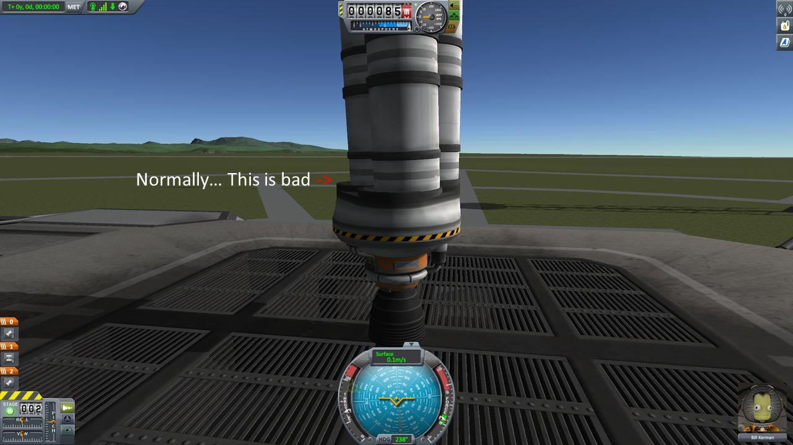
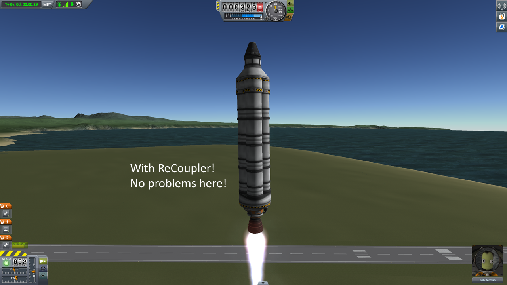
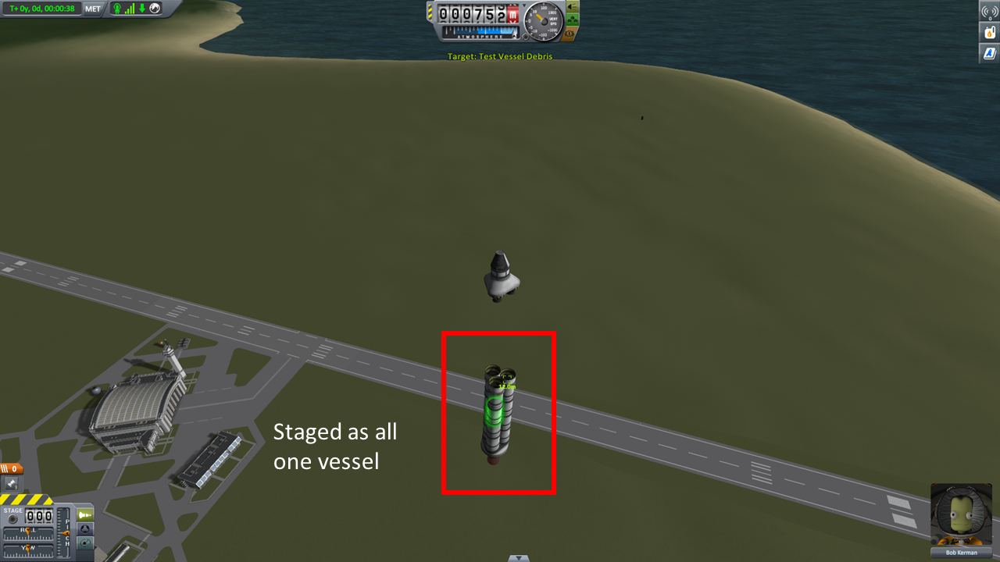

# ReCoup /L Unleashed

A Mod for Kerbal Space Program that fixes the inability to recombine stacks.

[Unleashed](https://ksp.lisias.net/add-ons-unleashed/) fork by Lisias.

## In a Hurry

* [Latest Release](https://github.com/net-lisias-kspu/ReCoupler/releases)
	+ [Binaries](https://github.com/net-lisias-kspu/ReCoupler/tree/Archive)
* [Source](https://github.com/net-lisias-kspu/ReCoupler)
* Documentation
	+ [Project's README](https://github.com/net-lisias-kspu/ReCoupler/blob/master/README.md)
	+ [Install Instructions](https://github.com/net-lisias-kspu/ReCoupler/blob/master/INSTALL.md)
	+ [Change Log](./CHANGE_LOG.md)

## Description

Ever want to use bi- or tri-couplers but want to recombine the stacks before the next stage? Ever wish you could make circular stations in the VAB without having to spam struts to keep the open end closed?

Here's the answer you've been looking for! **ReCoupler** works around the Vessel tree by identifying attach nodes that would have been connected but can't without a part having multiple parents or creating a circular structure. Once those nodes are identified, it hides them in the editor so that you don't accidentally connect anything else to that node. Then, in flight, it creates a structural link identical to the ones that normally hold parts together.

But wait! There's more! When decoupling (or explosions) happens, it detects if one of the virtual connections would continue holding the vessel together and magically makes that the real connection point as if no funny business had been happening!

## Installation

Detailed installation instructions are now on its own file (see the [In a Hurry](#in-a-hurry) section) and on the distribution file.

## License:

* This work is double licensed as follows:
	+ [SKL 1.0](https://ksp.lisias.net/SKL-1_0.txt). See [here](./LICENSE.KSPe.SKL-1_0)
		+ You are free to:
			- Use : unpack and use the material in any computer or device
			- Redistribute : redistribute the original package in any medium
		+ Under the following terms:
			- You agree to use the material only on (or to) KSP
			- You don't alter the package in any form or way (but you can embedded it)
			- You don't change the material in any way, and retain any copyright notices
			- You must explicitly state the author's Copyright, as well an Official Site for downloading the original and new versions (the one you used to download is good enough)
	+ [GPL 2.0](https://www.gnu.org/licenses/gpl-2.0.txt). See [here](./LICENSE.KSPe.GPL-2_0)
		+ You are free to:
			- Use : unpack and use the material in any computer or device
			- Redistribute : redistribute the original package in any medium
			- Adapt : Reuse, modify or incorporate source code into your works (and redistribute it!) 
		+ Under the following terms:
			- You retain any copyright notices
			- You recognise and respect any trademarks
			- You don't impersonate the authors, neither redistribute a derivative that could be misrepresented as theirs.
			- You credit the author and republish the copyright notices on your works where the code is used.
			- You relicense (and fully comply) your works using GPL 2.0
				- Please note that upgrading the license to GPLv3 **IS NOT ALLOWED** for this work, as the author **DID NOT** added the "or (at your option) any later version" on the license.
			- You don't mix your work with GPL incompatible works.
	* If by some reason the GPL would be invalid for you, rest assured that you still retain the right to Use the Work under SKL 1.0. 

Releases previous to 1.3.6.1 are still available under the [MIT/Expat](https://opensource.org/license/mit/) license [here](https://github.com/net-lisias-kspu/ReCoup/tree/Source/MIT). Please note this [statement](https://www.gnu.org/licenses/license-list.en.html#Expat) from FSF.

Please note the copyrights and trademarks in [NOTICE](./NOTICE).

## UPSTREAM

* [Boots](https://forum.kerbalspaceprogram.com/profile/62446-booots/) ROOT
	+ [Forum](https://forum.kerbalspaceprogram.com/topic/158136-*)
		- [Dev Thread](https://forum.kerbalspaceprogram.com/topic/157131-*)
	+ [SpaceDock](https://spacedock.info/mod/1250/ReCoupler)
	+ [Github](https://github.com/DBooots/ReCoupler)
